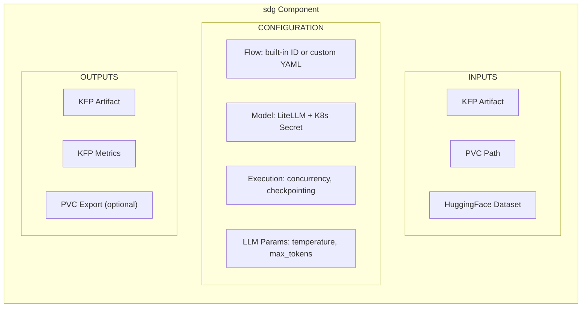
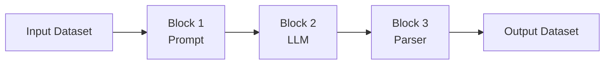
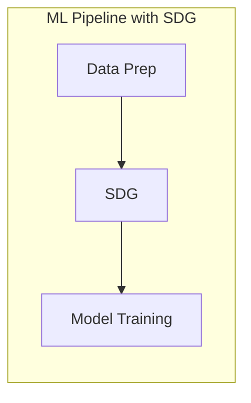
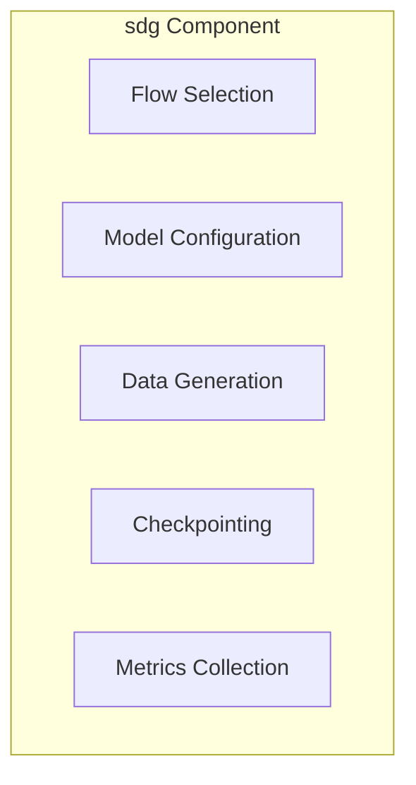
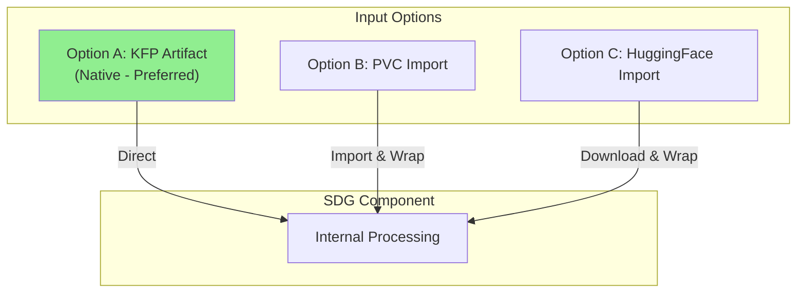
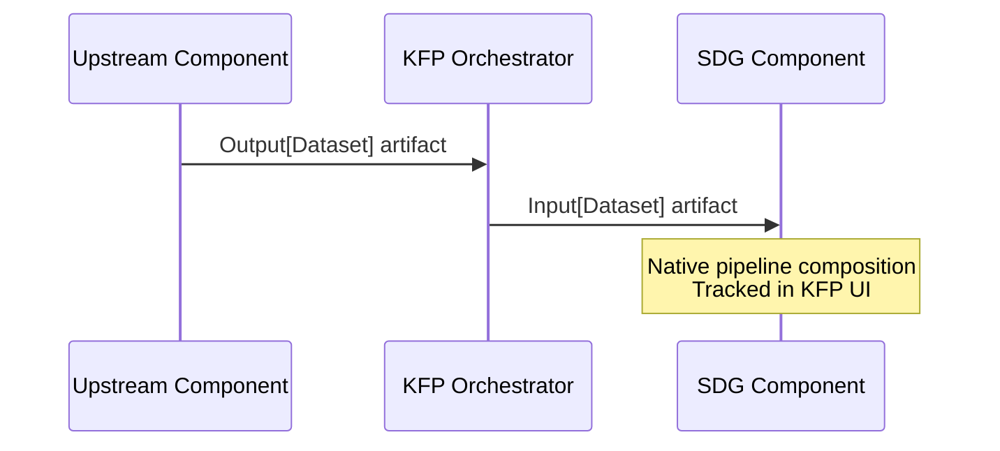
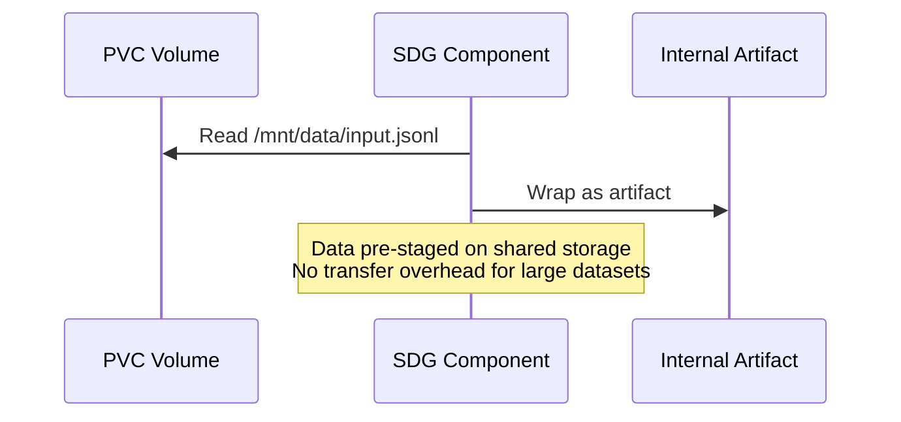
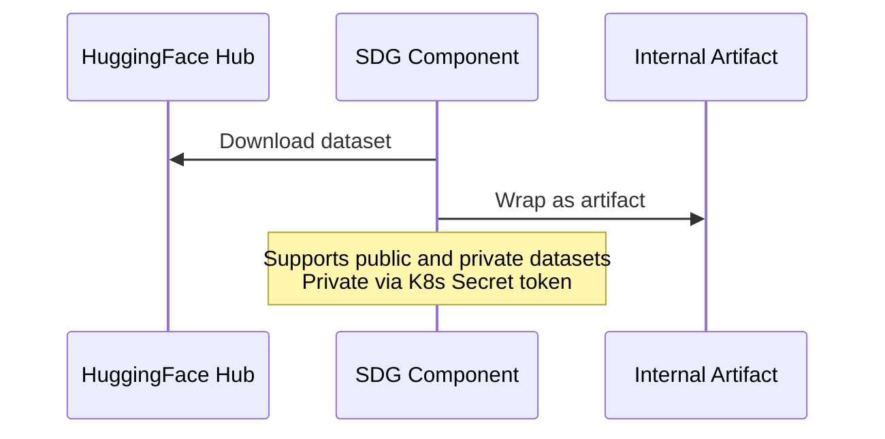
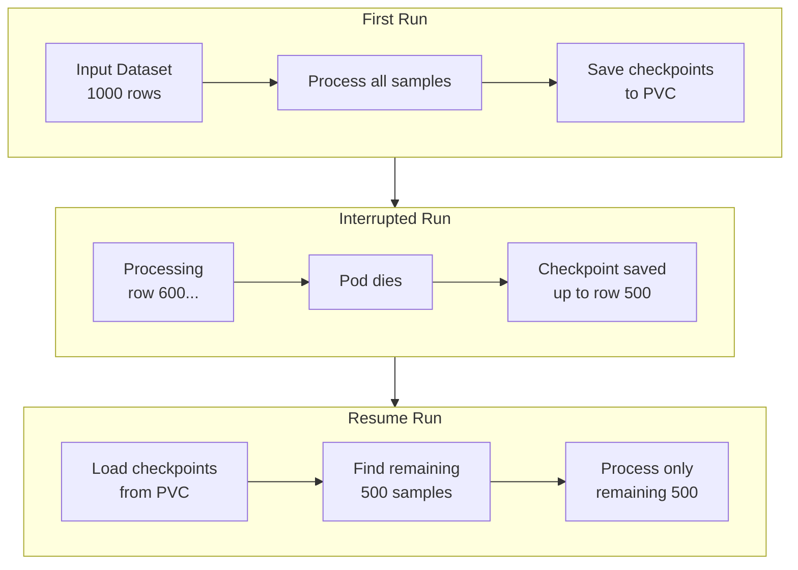
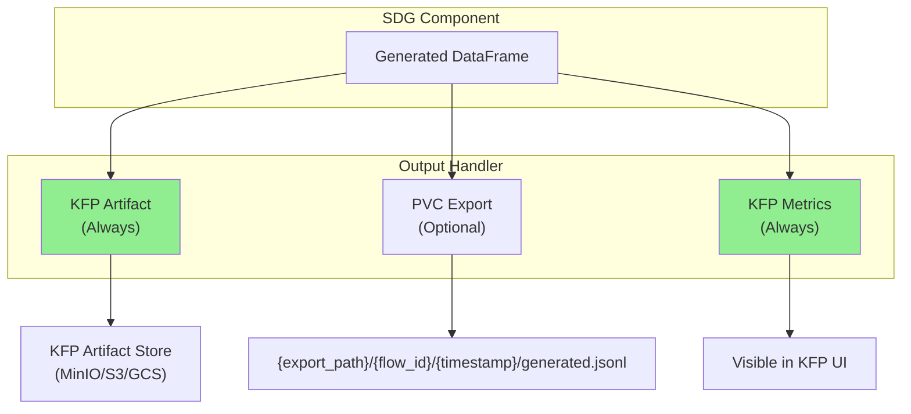

# SDG Hub KFP Component Architecture Design

## Document Information

| Field | Value |
|-------|-------|
| **Status** | Draft |
| **Authors** | SDG Hub Team |
| **Created** | 2025-01-16 |
| **Last Updated** | 2025-01-16 |

---

## Table of Contents

1. [Overview](#1-overview)
2. [Background & Motivation](#2-background--motivation)
3. [Component Scope & Granularity](#3-component-scope--granularity)
4. [Input Data Interface](#4-input-data-interface)
5. [Output Data Interface](#5-output-data-interface)
6. [Flow Selection & Configuration](#6-flow-selection--configuration) *(Pending)*
7. [Model/LLM Configuration](#7-modelllm-configuration) *(Pending)*
8. [Execution Configuration](#8-execution-configuration) *(Pending)*
9. [Error Handling & Observability](#9-error-handling--observability) *(Pending)*
10. [Container & Packaging](#10-container--packaging) *(Pending)*

---

## 1. Overview

### 1.1 What We Are Building

A **Kubeflow Pipelines (KFP) component** that wraps the SDG Hub SDK to enable synthetic data generation within Kubernetes-native ML pipelines. This component allows users to:

- Run SDG Hub flows (built-in or custom) as pipeline steps
- Generate synthetic training data at production scale
- Integrate seamlessly with upstream data preparation and downstream model training components

### 1.2 Component at a Glance



### 1.3 Design Principles

| Principle | Description |
|-----------|-------------|
| **Kubernetes Native** | Use K8s primitives: Secrets for credentials, PVCs for storage, ConfigMaps for configuration |
| **KFP Native** | Use KFP Artifacts for data passing, Metrics for observability, native pipeline composition |
| **Production Scale** | Designed for large datasets with checkpointing, concurrency control, and resumability |
| **Flexible I/O** | Support multiple input sources and output destinations for e2e pipeline integration |
| **Minimal Surface** | Expose only what's needed for production use; no experimentation/discovery features |

---

## 2. Background & Motivation

### 2.1 What is SDG Hub?

SDG Hub is a Python framework for synthetic data generation using composable blocks and flows:

- **Blocks** are atomic data transformation units (LLM chat, text parsing, filtering)
- **Flows** orchestrate multiple blocks into YAML-defined pipelines
- **Data flows** through blocks sequentially: `dataset -> Block1 -> Block2 -> ... -> enriched_dataset`



### 2.2 Why a KFP Component?

**Problem:** Organizations need to generate synthetic training data as part of their ML pipelines, but:

1. Running SDG manually doesn't integrate with existing pipeline infrastructure
2. Scaling requires Kubernetes orchestration
3. Credential management needs enterprise-grade security
4. Long-running jobs need checkpointing and observability

**Solution:** A KFP component that provides:

| Capability | Benefit |
|------------|---------|
| **Pipeline Integration** | Chain with data prep, training, and evaluation steps |
| **K8s Orchestration** | Automatic scheduling, resource management, scaling |
| **Secret Management** | Secure credential handling via K8s Secrets |
| **Checkpointing** | Resume interrupted jobs, survive pod restarts |
| **Observability** | Native KFP metrics, logging, artifact tracking |

### 2.3 Target Use Cases



Examples:
- **Knowledge tuning**: document -> QA pairs -> fine-tune LLM
- **Instruction tuning**: seed data -> diverse examples -> train
- **Data augmentation**: small dataset -> expanded dataset -> train

### 2.4 Non-Goals

The following are explicitly **out of scope** for this component:

- Flow/block discovery and exploration (use SDK directly)
- Interactive experimentation (use notebooks)
- Flow development and debugging (use SDK's dry_run locally)
- Multi-flow orchestration (use multiple component instances)

---

## 3. Component Scope & Granularity

### 3.1 Decision Summary

| Aspect | Decision |
|--------|----------|
| **Architecture** | Single monolithic component |
| **Flow Selection** | Support both built-in flows and custom YAML |
| **Scope** | Production execution only |

### 3.2 Selected: Single Monolithic Component

One component handles everything: flow selection, model config, execution.



**Why Selected:**
- Simple to use - one component does it all
- Fewer artifacts passed between components
- Matches production pattern: "run this flow on this data"
- Validation is built into `flow.generate()`

### 3.3 Rejected Options

| Option | Why Rejected |
|--------|--------------|
| **Multi-Component** (separate validate, generate, postprocess) | Adds complexity; validation already built into generate() |
| **Core + Utilities** (main component + discovery tools) | Utilities rarely used in production; extra maintenance |

---

## 4. Input Data Interface

### 4.1 Decision Summary

| Aspect | Decision |
|--------|----------|
| **Primary Interface** | KFP Artifact (native tracking & composition) |
| **Alternative Inputs** | Import from PVC, Import from HuggingFace |
| **File Format** | JSONL only |
| **Checkpoint Resume** | Via checkpoint PVC path |

### 4.2 Input Architecture

The component uses **KFP Artifacts as the primary interface** for pipeline composition and tracking. PVC and HuggingFace are "import" options that get converted to artifacts internally.



**Priority:** Artifact > PVC Path > HuggingFace

### 4.3 Input Flow Details

#### Option A: KFP Artifact (Native - Preferred)



#### Option B: PVC Import



#### Option C: HuggingFace Import



### 4.4 Why This Design?

| Alternative | Why Rejected |
|-------------|--------------|
| **KFP Artifacts Only** | Doesn't support pre-staged data; transfer overhead for large datasets |
| **Volume Paths Only** | Loses KFP native tracking; harder pipeline composition |

**Selected: Hybrid with Import/Export** because it provides KFP native tracking while supporting external data sources.

### 4.5 File Format Decision

| Format | Decision | Rationale |
|--------|----------|-----------|
| **JSONL** | Supported | Human-readable, matches SDK checkpoint format, simple |
| **Parquet/CSV** | Not supported | Adds complexity; JSONL sufficient for production |

### 4.6 HuggingFace Dataset Configuration

```yaml
hf_dataset_config:
  dataset_name: "squad"              # Required: dataset identifier
  config: "v2.0"                     # Optional: dataset configuration
  split: "train"                     # Optional: dataset split (default: "train")
  token_secret_name: "hf-token"      # Optional: K8s Secret for private datasets
```

### 4.7 Checkpoint Resume

The component supports resuming interrupted jobs via checkpoints stored on PVC.



**How It Works:**

1. On start: Check `checkpoint_pvc_path` for existing checkpoints
2. If found: Load completed samples, identify remaining work
3. Processing: Only process samples not yet completed
4. Periodic saves: Save checkpoints every `save_freq` samples
5. Final merge: Combine checkpoint data with newly processed data

**Why PVC for Checkpoints:** PVC persists across pod restarts; KFP temp paths and EmptyDir do not.

### 4.8 Component Interface (Input Parameters)

```python
@component
def sdg(
    # ==================== INPUT OPTIONS ====================
    # Option A: KFP Artifact (native, preferred)
    input_artifact: Input[Dataset] = None,

    # Option B: Import from PVC
    input_pvc_path: str = None,  # e.g., "/mnt/data/input.jsonl"

    # Option C: Import from HuggingFace
    hf_dataset_config: dict = None,
    # {
    #     "dataset_name": "squad",
    #     "config": "v2.0",
    #     "split": "train",
    #     "token_secret_name": "hf-creds"
    # }

    # ==================== CHECKPOINT RESUME ====================
    checkpoint_pvc_path: str = None,  # e.g., "/mnt/checkpoints/"
    # ...
):
```

### 4.9 Usage Examples

#### Example 1: Input from Upstream Component

```python
@dsl.pipeline
def training_pipeline():
    prep_task = data_preparation(raw_data_path="/data/raw")

    sdg_task = sdg(
        input_artifact=prep_task.outputs["output_dataset"],
        flow_id="extractive-summary-qa",
    )

    train_task = train_model(
        training_data=sdg_task.outputs["output_artifact"],
    )
```

#### Example 2: Input from PVC

```python
sdg_task = sdg(
    input_pvc_path="/mnt/shared-data/seed_documents.jsonl",
    flow_id="extractive-summary-qa",
)
```

#### Example 3: Resume from Checkpoint

```python
sdg_task = sdg(
    input_pvc_path="/mnt/data/large_dataset.jsonl",
    checkpoint_pvc_path="/mnt/checkpoints/job-123/",
    save_freq=100,
    flow_id="extractive-summary-qa",
)
# If pod restarts, checkpoints are automatically loaded and resumed
```

---

## 5. Output Data Interface

### 5.1 Decision Summary

| Aspect | Decision |
|--------|----------|
| **Primary Output** | KFP Artifact (always produced) |
| **Optional Export** | Export to PVC |
| **Output Structure** | Nested: `{path}/{flow_id}/{timestamp}/generated.jsonl` |
| **Metrics** | KFP Metrics artifact (native) |

### 5.2 Output Architecture

The component **always produces a KFP Artifact** for native pipeline composition. Users can **optionally export** to PVC for external access.



### 5.3 Why Always Produce KFP Artifact?

| Benefit | Description |
|---------|-------------|
| **Pipeline Composition** | Enables `sdg_task.outputs["output_artifact"]` for downstream steps |
| **Tracking** | Visible in KFP UI; linked to pipeline run |
| **Lineage** | KFP tracks artifact provenance automatically |
| **Consistency** | Same interface regardless of input source |

### 5.4 Optional PVC Export

When `export_to_pvc=True`, output is **also** written to PVC:

```
{export_path}/{flow_id}/{timestamp}/generated.jsonl

Example:
/mnt/output/extractive-summary-qa/20250116_143052/generated.jsonl
```

**Nested structure rationale:**
- `flow_id`: Identifies which flow produced the output
- `timestamp`: Supports multiple runs without overwriting

### 5.5 KFP Metrics

The component produces metrics visible in KFP UI:

```python
metrics.log_metric("total_input_rows", 1000)
metrics.log_metric("total_output_rows", 850)
metrics.log_metric("execution_time_seconds", 3456.7)
metrics.log_metric("successful_blocks", 8)
metrics.log_metric("failed_blocks", 0)
```

### 5.6 Component Interface (Output Parameters)

```python
@component
def sdg(
    # ... input parameters ...

    # ==================== OUTPUT ====================
    output_artifact: Output[Dataset],
    output_metrics: Output[Metrics],
    export_to_pvc: bool = False,
    export_path: str = None,  # e.g., "/mnt/output/"
):
```

### 5.7 Usage Examples

#### Example 1: Output to Downstream Component Only

```python
@dsl.pipeline
def training_pipeline():
    sdg_task = sdg(
        input_artifact=prep_task.outputs["dataset"],
        flow_id="qa-generation",
    )

    train_task = train_model(
        training_data=sdg_task.outputs["output_artifact"],
    )
```

#### Example 2: Output to Both Artifact and PVC

```python
sdg_task = sdg(
    input_pvc_path="/mnt/data/input.jsonl",
    flow_id="qa-generation",
    export_to_pvc=True,
    export_path="/mnt/output/",
)
# Output at: /mnt/output/qa-generation/20250116_143052/generated.jsonl
# Artifact still available for pipeline composition
```

---

## 6. Flow Selection & Configuration

*Status: Pending Design Discussion*

### 6.1 Topics to Cover

- Built-in flow selection via registry ID
- Custom flow YAML source (PVC, ConfigMap, artifact)
- Runtime parameters structure
- Common LLM parameter elevation
- Parameter override priority

---

## 7. Model/LLM Configuration

*Status: Pending Design Discussion*

### 7.1 Topics to Cover

- Model identifier handling (LiteLLM format)
- K8s Secret structure for credentials
- API endpoint configuration
- Secret mounting and environment variables

---

## 8. Execution Configuration

*Status: Pending Design Discussion*

### 8.1 Topics to Cover

- Concurrency control (`max_concurrency`)
- Checkpointing configuration (`checkpoint_pvc_path`, `save_freq`)
- Logging configuration
- Resource requests and limits

---

## 9. Error Handling & Observability

*Status: Pending Design Discussion*

### 9.1 Topics to Cover

- Failure modes and retry behavior
- Structured logging format
- Prometheus metrics exposure
- Health checks

---

## 10. Container & Packaging

*Status: Pending Design Discussion*

### 10.1 Topics to Cover

- Base image selection
- Dependency management
- Version strategy
- Component YAML generation

---

## Appendix A: Complete Component Interface (Draft)

```python
from kfp.dsl import component, Input, Output, Dataset, Metrics

@component(
    base_image="quay.io/redhat-ai-innovation/sdg-hub:latest",
)
def sdg(
    # ==================== INPUT OPTIONS ====================
    input_artifact: Input[Dataset] = None,
    input_pvc_path: str = None,
    hf_dataset_config: dict = None,

    # ==================== OUTPUT ====================
    output_artifact: Output[Dataset],
    output_metrics: Output[Metrics],
    export_to_pvc: bool = False,
    export_path: str = None,

    # ==================== FLOW SELECTION ====================
    flow_id: str = None,
    flow_yaml_path: str = None,

    # ==================== MODEL CONFIGURATION ====================
    model: str = None,
    model_secret_name: str = None,

    # ==================== EXECUTION ====================
    max_concurrency: int = 10,
    checkpoint_pvc_path: str = None,
    save_freq: int = 100,

    # ==================== LLM PARAMETERS ====================
    temperature: float = None,
    max_tokens: int = None,
    runtime_params: dict = None,
):
    """
    SDG Hub data generation component for Kubeflow Pipelines.

    Runs a synthetic data generation flow on input data, producing
    enriched output suitable for model training.
    """
    pass
```

---

## Appendix B: Glossary

| Term | Definition |
|------|------------|
| **Block** | Atomic data transformation unit in SDG Hub |
| **Flow** | YAML-defined pipeline of blocks |
| **KFP** | Kubeflow Pipelines |
| **Artifact** | Data object passed between KFP components |
| **PVC** | Persistent Volume Claim (K8s storage) |
| **LiteLLM** | Library supporting 100+ LLM providers with unified API |

---

## Revision History

| Version | Date | Author | Changes |
|---------|------|--------|---------|
| 0.1 | 2025-01-16 | SDG Hub Team | Initial draft with Phases 1-5 |
