# SDG Hub KFP Component Architecture Design

## Document Information

| Field | Value |
|-------|-------|
| **Status** | Draft |
| **Authors** | SDG Hub Team |
| **Created** | 2025-01-16 |
| **Last Updated** | 2025-01-16 |

---

## Table of Contents

1. [Overview](#1-overview)
2. [Background & Motivation](#2-background--motivation)
3. [Component Scope & Granularity](#3-component-scope--granularity)
4. [Input Data Interface](#4-input-data-interface)
5. [Output Data Interface](#5-output-data-interface)
6. [Flow Selection & Configuration](#6-flow-selection--configuration)
7. [Model/LLM Configuration](#7-modelllm-configuration)
8. [Execution Configuration](#8-execution-configuration) *(Pending)*
9. [Error Handling & Observability](#9-error-handling--observability) *(Pending)*
10. [Container & Packaging](#10-container--packaging) *(Pending)*

---

## 1. Overview

### 1.1 What We Are Building

A **Kubeflow Pipelines (KFP) component** that wraps the SDG Hub SDK to enable synthetic data generation within Kubernetes-native ML pipelines. This component allows users to:

- Run SDG Hub flows (built-in or custom) as pipeline steps
- Generate synthetic training data at production scale
- Integrate seamlessly with upstream data preparation and downstream model training components

### 1.2 Component at a Glance

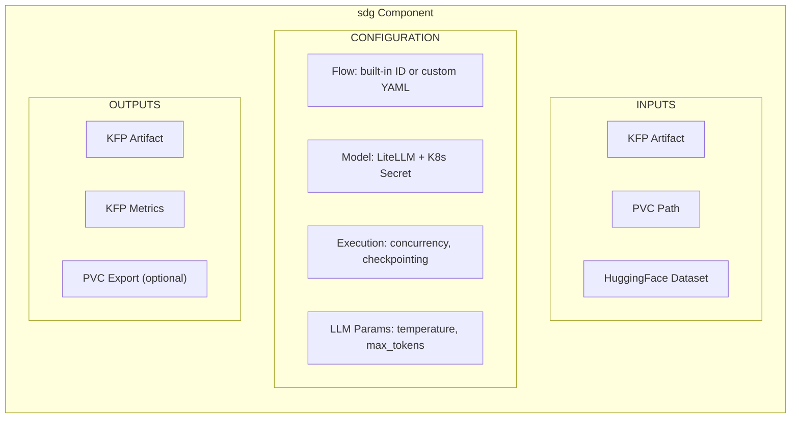

### 1.3 Design Principles

| Principle | Description |
|-----------|-------------|
| **Kubernetes Native** | Use K8s primitives: Secrets for credentials, PVCs for storage, ConfigMaps for configuration |
| **KFP Native** | Use KFP Artifacts for data passing, Metrics for observability, native pipeline composition |
| **Production Scale** | Designed for large datasets with checkpointing, concurrency control, and resumability |
| **Flexible I/O** | Support multiple input sources and output destinations for e2e pipeline integration |
| **Minimal Surface** | Expose only what's needed for production use; no experimentation/discovery features |

---

## 2. Background & Motivation

### 2.1 What is SDG Hub?

SDG Hub is a Python framework for synthetic data generation using composable blocks and flows:

- **Blocks** are atomic data transformation units (LLM chat, text parsing, filtering)
- **Flows** orchestrate multiple blocks into YAML-defined pipelines
- **Data flows** through blocks sequentially: `dataset -> Block1 -> Block2 -> ... -> enriched_dataset`

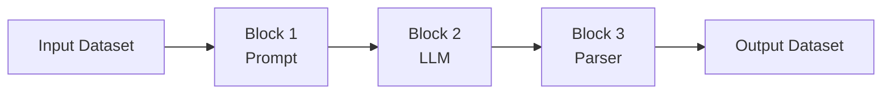

### 2.2 Why a KFP Component?

**Problem:** Organizations need to generate synthetic training data as part of their ML pipelines, but:

1. Running SDG manually doesn't integrate with existing pipeline infrastructure
2. Scaling requires Kubernetes orchestration
3. Credential management needs enterprise-grade security
4. Long-running jobs need checkpointing and observability

**Solution:** A KFP component that provides:

| Capability | Benefit |
|------------|---------|
| **Pipeline Integration** | Chain with data prep, training, and evaluation steps |
| **K8s Orchestration** | Automatic scheduling, resource management, scaling |
| **Secret Management** | Secure credential handling via K8s Secrets |
| **Checkpointing** | Resume interrupted jobs, survive pod restarts |
| **Observability** | Native KFP metrics, logging, artifact tracking |

### 2.3 Target Use Cases

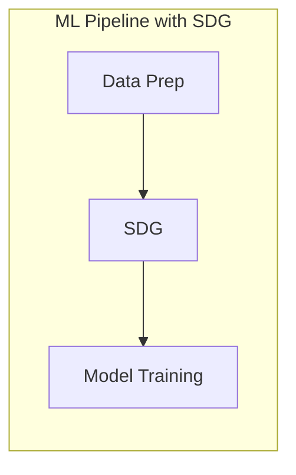

Examples:
- **Knowledge tuning**: document -> QA pairs -> fine-tune LLM
- **Instruction tuning**: seed data -> diverse examples -> train
- **Data augmentation**: small dataset -> expanded dataset -> train

### 2.4 Non-Goals

The following are explicitly **out of scope** for this component:

- Flow/block discovery and exploration (use SDK directly)
- Interactive experimentation (use notebooks)
- Flow development and debugging (use SDK's dry_run locally)
- Multi-flow orchestration (use multiple component instances)

---

## 3. Component Scope & Granularity

### 3.1 Decision Summary

| Aspect | Decision |
|--------|----------|
| **Architecture** | Single monolithic component |
| **Flow Selection** | Support both built-in flows and custom YAML |
| **Scope** | Production execution only |

### 3.2 Selected: Single Monolithic Component

One component handles everything: flow selection, model config, execution.

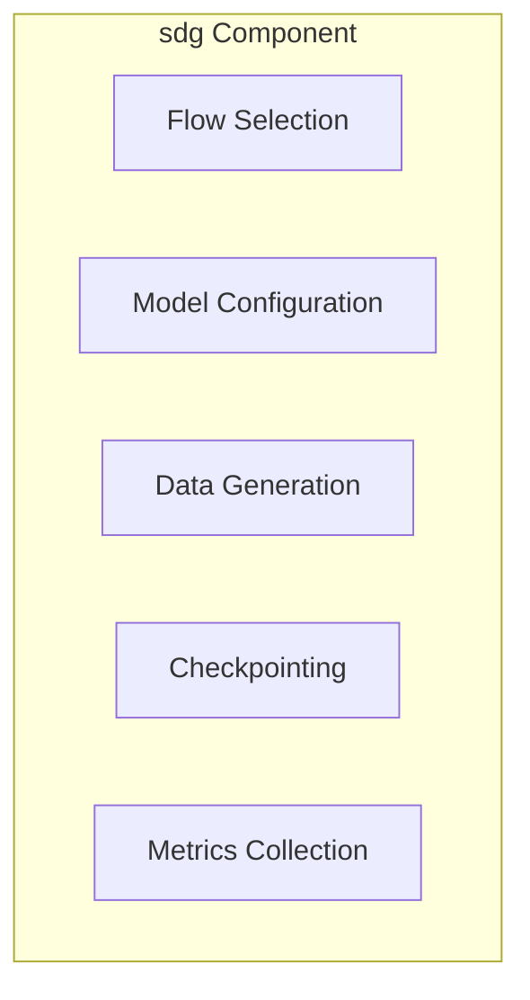

**Why Selected:**
- Simple to use - one component does it all
- Fewer artifacts passed between components
- Matches production pattern: "run this flow on this data"
- Validation is built into `flow.generate()`

### 3.3 Rejected Options

| Option | Why Rejected |
|--------|--------------|
| **Multi-Component** (separate validate, generate, postprocess) | Adds complexity; validation already built into generate() |
| **Core + Utilities** (main component + discovery tools) | Utilities rarely used in production; extra maintenance |

---

## 4. Input Data Interface

### 4.1 Decision Summary

| Aspect | Decision |
|--------|----------|
| **Primary Interface** | KFP Artifact (native tracking & composition) |
| **Alternative Inputs** | Import from PVC, Import from HuggingFace |
| **File Format** | JSONL only |
| **Checkpoint Resume** | Via checkpoint PVC path |

### 4.2 Input Architecture

The component uses **KFP Artifacts as the primary interface** for pipeline composition and tracking. PVC and HuggingFace are "import" options that get converted to artifacts internally.

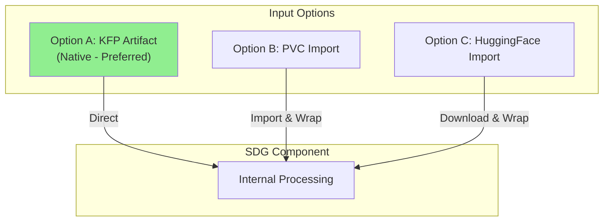

**Priority:** Artifact > PVC Path > HuggingFace

### 4.3 Input Flow Details

#### Option A: KFP Artifact (Native - Preferred)

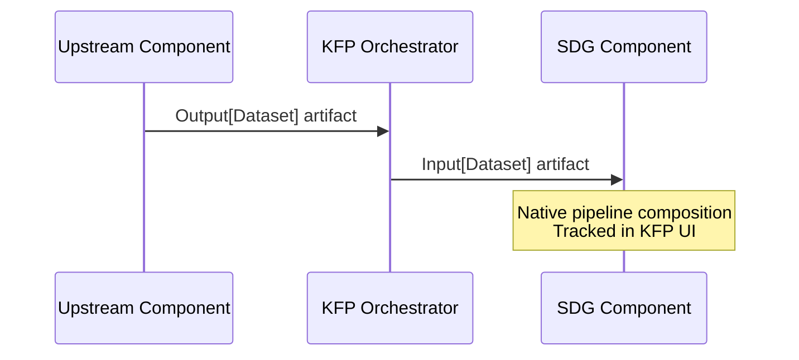

#### Option B: PVC Import

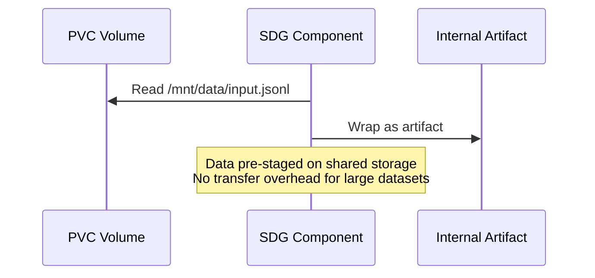

#### Option C: HuggingFace Import

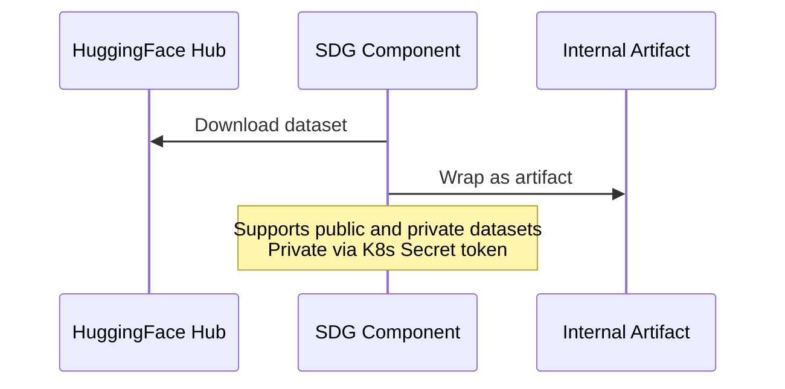

### 4.4 Why This Design?

| Alternative | Why Rejected |
|-------------|--------------|
| **KFP Artifacts Only** | Doesn't support pre-staged data; transfer overhead for large datasets |
| **Volume Paths Only** | Loses KFP native tracking; harder pipeline composition |

**Selected: Hybrid with Import/Export** because it provides KFP native tracking while supporting external data sources.

### 4.5 File Format Decision

| Format | Decision | Rationale |
|--------|----------|-----------|
| **JSONL** | Supported | Human-readable, matches SDK checkpoint format, simple |
| **Parquet/CSV** | Not supported | Adds complexity; JSONL sufficient for production |

### 4.6 HuggingFace Dataset Configuration

```yaml
hf_dataset_config:
  dataset_name: "squad"              # Required: dataset identifier
  config: "v2.0"                     # Optional: dataset configuration
  split: "train"                     # Optional: dataset split (default: "train")
  token_secret_name: "hf-token"      # Optional: K8s Secret for private datasets
```

### 4.7 Checkpoint Resume

The component supports resuming interrupted jobs via checkpoints stored on PVC.

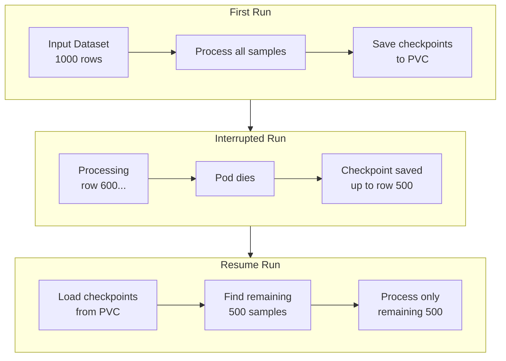

**How It Works:**

1. On start: Check `checkpoint_pvc_path` for existing checkpoints
2. If found: Load completed samples, identify remaining work
3. Processing: Only process samples not yet completed
4. Periodic saves: Save checkpoints every `save_freq` samples
5. Final merge: Combine checkpoint data with newly processed data

**Why PVC for Checkpoints:** PVC persists across pod restarts; KFP temp paths and EmptyDir do not.

### 4.8 Component Interface (Input Parameters)

```python
@component
def sdg(
    # ==================== INPUT OPTIONS ====================
    # Option A: KFP Artifact (native, preferred)
    input_artifact: Input[Dataset] = None,

    # Option B: Import from PVC
    input_pvc_path: str = None,  # e.g., "/mnt/data/input.jsonl"

    # Option C: Import from HuggingFace
    hf_dataset_config: dict = None,
    # {
    #     "dataset_name": "squad",
    #     "config": "v2.0",
    #     "split": "train",
    #     "token_secret_name": "hf-creds"
    # }

    # ==================== CHECKPOINT RESUME ====================
    checkpoint_pvc_path: str = None,  # e.g., "/mnt/checkpoints/"
    # ...
):
```

### 4.9 Usage Examples

#### Example 1: Input from Upstream Component

```python
@dsl.pipeline
def training_pipeline():
    prep_task = data_preparation(raw_data_path="/data/raw")

    sdg_task = sdg(
        input_artifact=prep_task.outputs["output_dataset"],
        flow_id="extractive-summary-qa",
    )

    train_task = train_model(
        training_data=sdg_task.outputs["output_artifact"],
    )
```

#### Example 2: Input from PVC

```python
sdg_task = sdg(
    input_pvc_path="/mnt/shared-data/seed_documents.jsonl",
    flow_id="extractive-summary-qa",
)
```

#### Example 3: Resume from Checkpoint

```python
sdg_task = sdg(
    input_pvc_path="/mnt/data/large_dataset.jsonl",
    checkpoint_pvc_path="/mnt/checkpoints/job-123/",
    save_freq=100,
    flow_id="extractive-summary-qa",
)
# If pod restarts, checkpoints are automatically loaded and resumed
```

---

## 5. Output Data Interface

### 5.1 Decision Summary

| Aspect | Decision |
|--------|----------|
| **Primary Output** | KFP Artifact (always produced) |
| **Optional Export** | Export to PVC |
| **Output Structure** | Nested: `{path}/{flow_id}/{timestamp}/generated.jsonl` |
| **Metrics** | KFP Metrics artifact (native) |

### 5.2 Output Architecture

The component **always produces a KFP Artifact** for native pipeline composition. Users can **optionally export** to PVC for external access.

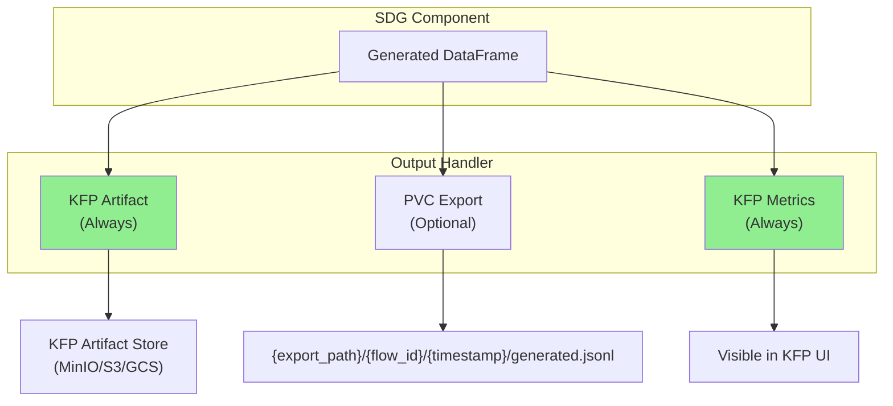

### 5.3 Why Always Produce KFP Artifact?

| Benefit | Description |
|---------|-------------|
| **Pipeline Composition** | Enables `sdg_task.outputs["output_artifact"]` for downstream steps |
| **Tracking** | Visible in KFP UI; linked to pipeline run |
| **Lineage** | KFP tracks artifact provenance automatically |
| **Consistency** | Same interface regardless of input source |

### 5.4 Optional PVC Export

When `export_to_pvc=True`, output is **also** written to PVC:

```
{export_path}/{flow_id}/{timestamp}/generated.jsonl

Example:
/mnt/output/extractive-summary-qa/20250116_143052/generated.jsonl
```

**Nested structure rationale:**
- `flow_id`: Identifies which flow produced the output
- `timestamp`: Supports multiple runs without overwriting

### 5.5 KFP Metrics

The component produces metrics visible in KFP UI:

```python
metrics.log_metric("total_input_rows", 1000)
metrics.log_metric("total_output_rows", 850)
metrics.log_metric("execution_time_seconds", 3456.7)
metrics.log_metric("successful_blocks", 8)
metrics.log_metric("failed_blocks", 0)
```

### 5.6 Component Interface (Output Parameters)

```python
@component
def sdg(
    # ... input parameters ...

    # ==================== OUTPUT ====================
    output_artifact: Output[Dataset],
    output_metrics: Output[Metrics],
    export_to_pvc: bool = False,
    export_path: str = None,  # e.g., "/mnt/output/"
):
```

### 5.7 Usage Examples

#### Example 1: Output to Downstream Component Only

```python
@dsl.pipeline
def training_pipeline():
    sdg_task = sdg(
        input_artifact=prep_task.outputs["dataset"],
        flow_id="qa-generation",
    )

    train_task = train_model(
        training_data=sdg_task.outputs["output_artifact"],
    )
```

#### Example 2: Output to Both Artifact and PVC

```python
sdg_task = sdg(
    input_pvc_path="/mnt/data/input.jsonl",
    flow_id="qa-generation",
    export_to_pvc=True,
    export_path="/mnt/output/",
)
# Output at: /mnt/output/qa-generation/20250116_143052/generated.jsonl
# Artifact still available for pipeline composition
```

---

## 6. Flow Selection & Configuration

### 6.1 Decision Summary

| Aspect | Decision |
|--------|----------|
| **Flow Selection** | Built-in flow ID or custom YAML path |
| **Custom Flow Source** | Path-based (YAML mounted from ConfigMap) |
| **Runtime Params Structure** | Flat dict (matches SDK) |
| **Component-Level LLM Params** | Mirror SDK block-level params |
| **Override Priority** | Flow YAML → Component-level → Block-level |
| **Flow Validation** | No pre-validation; rely on generate() fail-fast |

### 6.2 Flow Selection Modes

The component supports two mutually exclusive modes for specifying which flow to run:

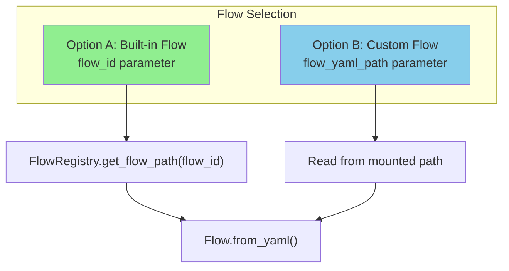

| Mode | Parameter | Use Case |
|------|-----------|----------|
| **Built-in Flow** | `flow_id` | Use pre-packaged flows from SDG Hub registry |
| **Custom Flow** | `flow_yaml_path` | Use custom flow YAML mounted from ConfigMap |

**Priority:** If both provided, `flow_yaml_path` takes precedence.

### 6.3 Custom Flow YAML from ConfigMap

Custom flow YAML files are mounted into the container from Kubernetes ConfigMaps. This follows K8s-native configuration patterns.

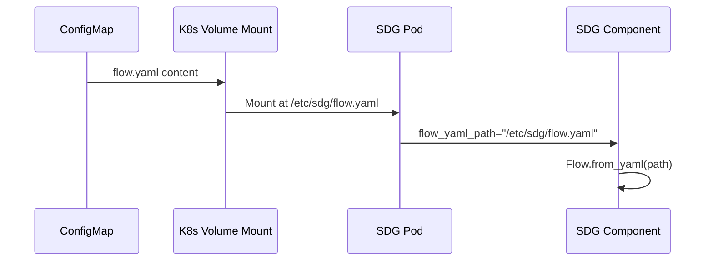

**Why ConfigMap over other options:**

| Alternative | Why Not Selected |
|-------------|------------------|
| **Inline YAML as string param** | Unwieldy for complex flows; hard to manage |
| **KFP Artifact** | Flows are config, not data; ConfigMap is more appropriate |
| **PVC only** | ConfigMap is more K8s-native for configuration |

**Note:** PVC paths also work since the component just reads from a file path. ConfigMap is the recommended approach for K8s-native configuration management.

#### ConfigMap Example

```yaml
# K8s ConfigMap definition
apiVersion: v1
kind: ConfigMap
metadata:
  name: custom-qa-flow
  namespace: ml-pipelines
data:
  flow.yaml: |
    metadata:
      name: "Custom QA Generation Flow"
      version: "1.0.0"
      description: "Organization-specific QA generation"

    blocks:
      - block_type: PromptBuilderBlock
        block_config:
          block_name: build_prompt
          input_cols: ["document"]
          output_cols: ["messages"]
          prompt_config_path: prompt.yaml

      - block_type: LLMChatBlock
        block_config:
          block_name: generate_qa
          input_cols: ["messages"]
          output_cols: ["response"]
          max_tokens: 2048
```

#### Pipeline Usage with ConfigMap

```python
from kfp import dsl
from kfp import kubernetes

@dsl.pipeline
def training_pipeline():
    sdg_task = sdg(
        input_pvc_path="/mnt/data/input.jsonl",
        flow_yaml_path="/etc/sdg/flow.yaml",  # Mounted from ConfigMap
        model="hosted_vllm/meta-llama/Llama-3.3-70B-Instruct",
    )

    # Mount ConfigMap as volume
    kubernetes.use_config_map_as_volume(
        sdg_task,
        config_map_name="custom-qa-flow",
        mount_path="/etc/sdg",
    )
```

### 6.4 Parameter Override System

The component implements a three-tier parameter override system that mirrors the SDK's behavior while adding a component-level tier for convenience.

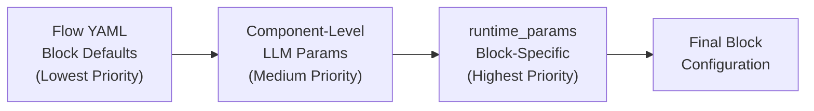

**Override Priority (lowest to highest):**

1. **Flow YAML Defaults**: Parameters defined in the flow's block configurations
2. **Component-Level Params**: Global LLM parameters passed to the component
3. **Block-Level Overrides**: Per-block settings in `runtime_params` dict

### 6.5 Component-Level LLM Parameters

The component exposes common LLM parameters at the component level for convenience. These are applied globally to all LLM blocks, then can be overridden per-block via `runtime_params`.

**Parameters (mirroring SDK's LLMChatBlock):**

| Parameter | Type | Description |
|-----------|------|-------------|
| `temperature` | float | Generation randomness (0.0-2.0) |
| `max_tokens` | int | Maximum response length |
| `top_p` | float | Nucleus sampling threshold (0.0-1.0) |
| `n` | int | Number of completions per input |
| `presence_penalty` | float | Penalize new topics (-2.0 to 2.0) |
| `frequency_penalty` | float | Penalize repetition (-2.0 to 2.0) |

**Why expose at component level:**

- **Convenience**: Common parameters don't require `runtime_params` dict
- **Discoverability**: Visible in component interface documentation
- **SDK Consistency**: Matches parameters available on SDK blocks

### 6.6 Runtime Parameters (Block-Level Overrides)

The `runtime_params` parameter accepts a flat dict matching the SDK's interface. Keys are block names, values are parameter dicts.

```python
runtime_params = {
    # Block-specific overrides (keyed by block_name)
    "gen_detailed_summary": {
        "n": 50,
        "max_tokens": 4096,
        "temperature": 0.5,
    },
    "question_generation": {
        "temperature": 0.9,
        "max_tokens": 256,
    },
    "quality_filter": {
        "filter_value": 0.85,
    },
}
```

**Why flat dict over structured list:**

| Alternative | Why Not Selected |
|-------------|------------------|
| **Structured list** `[{block_name: ..., params: {...}}]` | More verbose; doesn't match SDK interface |

**Selected: Flat dict** for SDK consistency and simplicity.

### 6.7 Flow Validation

The component does **not** perform pre-validation (dry_run) before execution.

**Rationale:**

- `flow.generate()` already validates inputs and fails fast with clear errors
- Pre-validation adds latency without benefit in production
- Flows used in production are pre-tested during development
- Clear error messages from `generate()` are sufficient for debugging

### 6.8 Component Interface (Flow & Params)

```python
@component
def sdg(
    # ... input/output params ...

    # ==================== FLOW SELECTION ====================
    flow_id: str = None,           # Built-in flow from registry
    flow_yaml_path: str = None,    # Custom flow (mounted from ConfigMap)

    # ==================== COMPONENT-LEVEL LLM PARAMS ====================
    # Applied globally to all LLM blocks; overridable by runtime_params
    temperature: float = None,
    max_tokens: int = None,
    top_p: float = None,
    n: int = None,
    presence_penalty: float = None,
    frequency_penalty: float = None,

    # ==================== BLOCK-LEVEL OVERRIDES ====================
    runtime_params: dict = None,
    # Example:
    # {
    #     "gen_detailed_summary": {"n": 50, "max_tokens": 4096},
    #     "question_generation": {"temperature": 0.9},
    # }
):
```

### 6.9 Usage Examples

#### Example 1: Built-in Flow with Component-Level Params

```python
sdg_task = sdg(
    input_pvc_path="/mnt/data/input.jsonl",
    flow_id="extractive-summary-qa",

    # Component-level params (apply to all LLM blocks)
    temperature=0.7,
    max_tokens=2048,
)
```

#### Example 2: Custom Flow from ConfigMap

```python
@dsl.pipeline
def custom_flow_pipeline():
    sdg_task = sdg(
        input_pvc_path="/mnt/data/input.jsonl",
        flow_yaml_path="/etc/sdg/flow.yaml",
        temperature=0.7,
    )

    # Mount ConfigMap
    kubernetes.use_config_map_as_volume(
        sdg_task,
        config_map_name="my-custom-flow",
        mount_path="/etc/sdg",
    )
```

#### Example 3: Component-Level + Block-Level Overrides

```python
sdg_task = sdg(
    input_pvc_path="/mnt/data/input.jsonl",
    flow_id="extractive-summary-qa",

    # Component-level defaults
    temperature=0.7,
    max_tokens=2048,

    # Block-specific overrides (highest priority)
    runtime_params={
        "gen_detailed_summary": {
            "n": 50,
            "temperature": 0.5,  # Overrides component-level 0.7
            "max_tokens": 4096,  # Overrides component-level 2048
        },
        "question_generation": {
            "temperature": 0.9,  # Overrides component-level 0.7
        },
    },
)
```

In this example:
- `gen_detailed_summary` uses temperature=0.5, max_tokens=4096
- `question_generation` uses temperature=0.9, max_tokens=2048 (component default)
- Other LLM blocks use temperature=0.7, max_tokens=2048 (component defaults)

---

## 7. Model/LLM Configuration

### 7.1 Decision Summary

| Aspect | Decision |
|--------|----------|
| **Model Identifier** | Simple string parameter (LiteLLM format) |
| **Credential Storage** | K8s Secret with dedicated keys |
| **Secret Structure** | `api_key` and `api_base` keys |
| **Multiple Models** | Not supported (SDK limitation) |

### 7.2 Model Identifier

The `model` parameter accepts a LiteLLM format string that specifies both the provider and model.

```python
model = "hosted_vllm/meta-llama/Llama-3.3-70B-Instruct"
#        ^^^^^^^^^^^  ^^^^^^^^^^^^^^^^^^^^^^^^^^^^^^^^^^
#        provider     model name
```

**Common LiteLLM provider formats:**

| Provider | Format | Example |
|----------|--------|---------|
| **vLLM** | `hosted_vllm/{model}` | `hosted_vllm/meta-llama/Llama-3.3-70B-Instruct` |
| **OpenAI** | `openai/{model}` | `openai/gpt-4` |
| **Azure OpenAI** | `azure/{deployment}` | `azure/gpt-4-deployment` |
| **Anthropic** | `anthropic/{model}` | `anthropic/claude-3-opus` |

**Why simple string (not structured dict):**
- LiteLLM already encodes provider in the model string
- Matches SDK interface
- Simple and familiar

### 7.3 Credential Storage with K8s Secrets

Credentials are stored in Kubernetes Secrets and mounted as environment variables using KFP's native `kubernetes.use_secret_as_env()`.

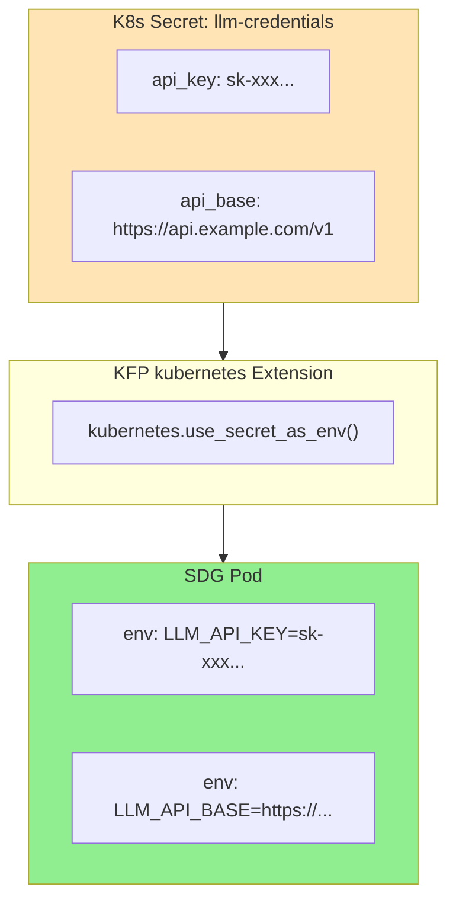

**Why K8s Secrets over other options:**

| Alternative | Why Not Selected |
|-------------|------------------|
| **Inline parameters** | Credentials visible in pipeline definition and logs |
| **ConfigMap** | Not designed for sensitive data; no encryption at rest |
| **External vault** | Adds complexity; K8s Secrets sufficient for most cases |

### 7.4 Secret Structure

The secret uses **dedicated key names** (`api_key`, `api_base`) rather than LiteLLM environment variable names. The component maps these to the appropriate LiteLLM environment variables.

```yaml
# K8s Secret definition
apiVersion: v1
kind: Secret
metadata:
  name: llm-credentials
  namespace: ml-pipelines
type: Opaque
stringData:
  api_key: "sk-xxxxxxxxxxxxxxxxxxxx"
  api_base: "https://api.example.com/v1"
```

**Why dedicated keys (not LiteLLM env var names like `OPENAI_API_KEY`):**

| Alternative | Why Not Selected |
|-------------|------------------|
| **LiteLLM env var names** | Provider-specific; breaks if user changes model |
| **Provider-prefixed keys** | Complex; requires multiple keys per provider |

**Selected: Generic keys** that the component maps to the correct env vars based on the model provider.

### 7.5 Secret Mounting in Pipelines

The component leverages KFP's native Kubernetes extension for secret mounting.

```python
from kfp import dsl
from kfp import kubernetes

@dsl.pipeline
def training_pipeline():
    sdg_task = sdg(
        input_pvc_path="/mnt/data/input.jsonl",
        flow_id="extractive-summary-qa",
        model="hosted_vllm/meta-llama/Llama-3.3-70B-Instruct",
        model_secret_name="llm-credentials",
    )

    # Mount secret as environment variables
    kubernetes.use_secret_as_env(
        sdg_task,
        secret_name="llm-credentials",
        secret_key_to_env={
            "api_key": "LLM_API_KEY",
            "api_base": "LLM_API_BASE",
        },
    )
```

**Internal component logic:**

```python
# Inside component implementation
import os

api_key = os.environ.get("LLM_API_KEY")
api_base = os.environ.get("LLM_API_BASE")

# Configure LiteLLM with these credentials
# (maps to appropriate provider-specific env vars internally)
```

### 7.6 Multiple Model Support

The component supports **only a single model configuration** per execution.

**Reason:** The SDK currently configures one LLM client globally for all blocks. Per-block model overrides are not supported in the SDK's `runtime_params`.

**Workaround for multi-model workflows:**

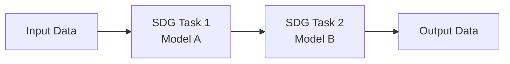

Use separate SDG component instances in sequence, each with its own model configuration.

### 7.7 Component Interface (Model Parameters)

```python
@component
def sdg(
    # ... other params ...

    # ==================== MODEL CONFIGURATION ====================
    model: str = None,
    # LiteLLM format: "provider/model-name"
    # Example: "hosted_vllm/meta-llama/Llama-3.3-70B-Instruct"

    model_secret_name: str = None,
    # K8s Secret name containing api_key and api_base
    # Mounted via kubernetes.use_secret_as_env()
):
```

### 7.8 Usage Examples

#### Example 1: vLLM Endpoint

```yaml
# Secret
apiVersion: v1
kind: Secret
metadata:
  name: vllm-credentials
stringData:
  api_key: "token-abc123"
  api_base: "https://vllm.internal.company.com/v1"
```

```python
@dsl.pipeline
def pipeline():
    sdg_task = sdg(
        input_pvc_path="/mnt/data/input.jsonl",
        flow_id="extractive-summary-qa",
        model="hosted_vllm/meta-llama/Llama-3.3-70B-Instruct",
        model_secret_name="vllm-credentials",
    )

    kubernetes.use_secret_as_env(
        sdg_task,
        secret_name="vllm-credentials",
        secret_key_to_env={
            "api_key": "LLM_API_KEY",
            "api_base": "LLM_API_BASE",
        },
    )
```

#### Example 2: OpenAI API

```yaml
# Secret
apiVersion: v1
kind: Secret
metadata:
  name: openai-credentials
stringData:
  api_key: "sk-xxxxxxxxxxxxxxxxxxxx"
  api_base: "https://api.openai.com/v1"
```

```python
@dsl.pipeline
def pipeline():
    sdg_task = sdg(
        input_pvc_path="/mnt/data/input.jsonl",
        flow_id="extractive-summary-qa",
        model="openai/gpt-4",
        model_secret_name="openai-credentials",
    )

    kubernetes.use_secret_as_env(
        sdg_task,
        secret_name="openai-credentials",
        secret_key_to_env={
            "api_key": "LLM_API_KEY",
            "api_base": "LLM_API_BASE",
        },
    )
```

---

## 8. Execution Configuration

*Status: Pending Design Discussion*

### 8.1 Topics to Cover

- Concurrency control (`max_concurrency`)
- Checkpointing configuration (`checkpoint_pvc_path`, `save_freq`)
- Logging configuration
- Resource requests and limits

---

## 9. Error Handling & Observability

*Status: Pending Design Discussion*

### 9.1 Topics to Cover

- Failure modes and retry behavior
- Structured logging format
- Prometheus metrics exposure
- Health checks

---

## 10. Container & Packaging

*Status: Pending Design Discussion*

### 10.1 Topics to Cover

- Base image selection
- Dependency management
- Version strategy
- Component YAML generation

---

## Appendix A: Complete Component Interface (Draft)

```python
from kfp.dsl import component, Input, Output, Dataset, Metrics

@component(
    base_image="quay.io/redhat-ai-innovation/sdg-hub:latest",
)
def sdg(
    # ==================== INPUT OPTIONS ====================
    input_artifact: Input[Dataset] = None,
    input_pvc_path: str = None,
    hf_dataset_config: dict = None,

    # ==================== OUTPUT ====================
    output_artifact: Output[Dataset],
    output_metrics: Output[Metrics],
    export_to_pvc: bool = False,
    export_path: str = None,

    # ==================== FLOW SELECTION ====================
    flow_id: str = None,
    flow_yaml_path: str = None,

    # ==================== MODEL CONFIGURATION ====================
    model: str = None,
    model_secret_name: str = None,

    # ==================== EXECUTION ====================
    max_concurrency: int = 10,
    checkpoint_pvc_path: str = None,
    save_freq: int = 100,

    # ==================== COMPONENT-LEVEL LLM PARAMETERS ====================
    # Applied globally to all LLM blocks; overridable by runtime_params
    temperature: float = None,
    max_tokens: int = None,
    top_p: float = None,
    n: int = None,
    presence_penalty: float = None,
    frequency_penalty: float = None,

    # ==================== BLOCK-LEVEL OVERRIDES ====================
    runtime_params: dict = None,
):
    """
    SDG Hub data generation component for Kubeflow Pipelines.

    Runs a synthetic data generation flow on input data, producing
    enriched output suitable for model training.

    Args:
        input_artifact: KFP Dataset artifact from upstream component
        input_pvc_path: Path to JSONL file on mounted PVC
        hf_dataset_config: HuggingFace dataset configuration dict
        output_artifact: KFP Dataset artifact for downstream components
        output_metrics: KFP Metrics artifact with execution stats
        export_to_pvc: Whether to also write output to PVC
        export_path: Base path for PVC export
        flow_id: Built-in flow ID from SDG Hub registry
        flow_yaml_path: Path to custom flow YAML (mounted from ConfigMap)
        model: LiteLLM model identifier
        model_secret_name: K8s Secret containing api_key and api_base
        max_concurrency: Maximum concurrent LLM requests
        checkpoint_pvc_path: PVC path for checkpoints (enables resume)
        save_freq: Checkpoint save frequency (samples)
        temperature: LLM temperature (0.0-2.0)
        max_tokens: Maximum response tokens
        top_p: Nucleus sampling threshold (0.0-1.0)
        n: Number of completions per input
        presence_penalty: Presence penalty (-2.0 to 2.0)
        frequency_penalty: Frequency penalty (-2.0 to 2.0)
        runtime_params: Block-specific parameter overrides
    """
    pass
```

---

## Appendix B: Glossary

| Term | Definition |
|------|------------|
| **Block** | Atomic data transformation unit in SDG Hub |
| **Flow** | YAML-defined pipeline of blocks |
| **KFP** | Kubeflow Pipelines |
| **Artifact** | Data object passed between KFP components |
| **PVC** | Persistent Volume Claim (K8s storage) |
| **LiteLLM** | Library supporting 100+ LLM providers with unified API |

---

## Revision History

| Version | Date | Author | Changes |
|---------|------|--------|---------|
| 0.1 | 2025-01-16 | SDG Hub Team | Initial draft with Phases 1-6 |
| 0.2 | 2025-01-16 | SDG Hub Team | Added Phase 7: Model/LLM Configuration |
