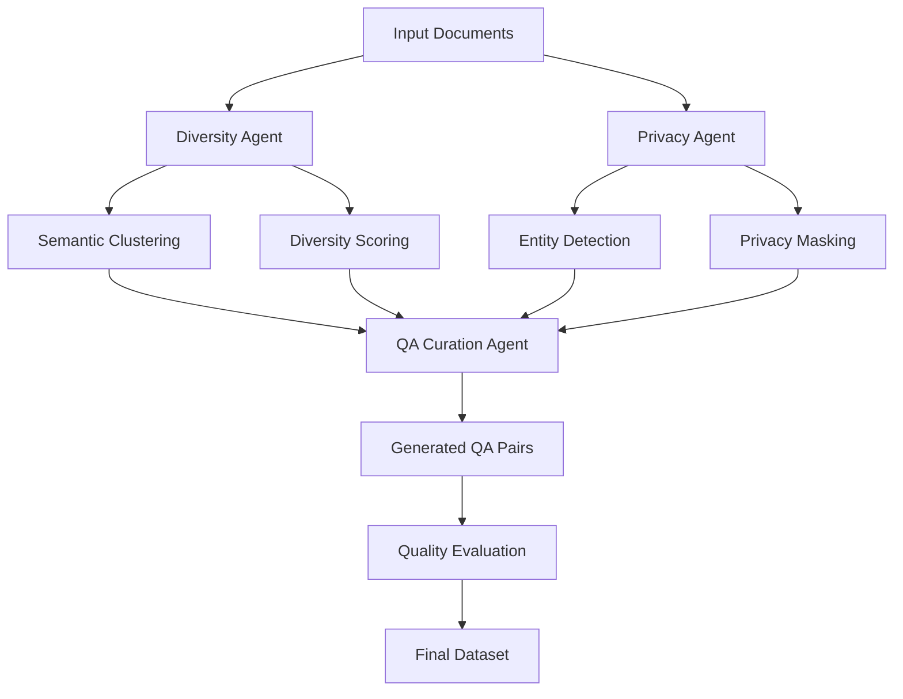

# Multi-Agent Diverse and Private Synthetic QA Dataset Generation for RAG Evaluation

This flow implements the multi-agent framework described in the research paper "Diverse And Private Synthetic Datasets Generation for RAG evaluation: A multi-agent framework" by Driouich et al. (2024).

## Overview

The framework consists of three specialized agents working together to generate high-quality synthetic QA datasets for RAG system evaluation:

1. **Diversity Agent**: Uses clustering techniques to maximize topical coverage and semantic variability
2. **Privacy Agent**: Detects and masks sensitive information across multiple domains
3. **QA Curation Agent**: Synthesizes private and diverse QA pairs suitable for RAG evaluation

## Architecture



## Key Features

### Diversity Optimization
- **Semantic Clustering**: Groups documents by semantic similarity using sentence embeddings
- **Diversity Scoring**: Computes individual and overall diversity metrics
- **Topical Coverage**: Ensures comprehensive coverage across different semantic clusters
- **Cognitive Diversity**: Generates questions requiring different types of reasoning

### Privacy Preservation
- **Multi-Domain Detection**: Identifies sensitive information across medical, financial, legal, and personal domains
- **Flexible Masking**: Supports entity replacement, redaction, and synthetic replacement strategies
- **Privacy Scoring**: Quantifies privacy compliance for quality assessment
- **Regulatory Compliance**: Aligns with privacy regulations like GDPR and HIPAA

### Quality Assurance
- **Multi-Criteria Evaluation**: Assesses diversity, privacy, and faithfulness simultaneously
- **Automated Filtering**: Removes low-quality samples based on configurable thresholds
- **Comprehensive Metadata**: Generates detailed evaluation metadata for each QA pair

## Usage

### Basic Usage

```python
from sdg_hub.core.flow import Flow

# Load the flow
flow = Flow.from_yaml("flows/rag_evaluation/multi_agent_diverse_private/flow.yaml")

# Configure parameters
flow.set_parameters({
    "diversity_clusters": 8,
    "diversity_threshold": 0.75,
    "privacy_domains": ["medical", "financial", "personal"],
    "masking_strategy": "entity_replacement",
    "qa_pairs_per_document": 3,
    "quality_threshold": 0.8
})

# Run the flow
result_dataset = flow.run(input_dataset)
```

### Advanced Configuration

```python
# Custom privacy domains and entity types
flow.set_parameters({
    "privacy_domains": ["medical", "financial", "legal", "personal", "educational"],
    "masking_strategy": "synthetic_replacement",
    "entity_types": ["PERSON", "ORG", "GPE", "DATE", "MONEY", "PHONE", "EMAIL", "SSN", "CREDIT_CARD", "MEDICAL_ID"],
    "preserve_structure": True
})

# Diversity optimization settings
flow.set_parameters({
    "diversity_clusters": 12,
    "diversity_threshold": 0.8,
    "embedding_model": "sentence-transformers/all-mpnet-base-v2",
    "clustering_method": "kmeans",
    "max_features": 100
})
```

## Input Requirements

The flow expects a dataset with the following columns:

### Required Columns
- `document`: Text content for QA generation
- `domain`: Domain classification (e.g., "medical", "financial", "legal")

### Optional Columns
- `document_id`: Unique identifier for the document
- `metadata`: Additional document metadata

### 📋 Detailed Input Schema

For comprehensive documentation on input requirements, including:
- **PDF Processing Integration** with Docling
- **Large Document Collections** handling
- **Domain Classification** guidelines
- **Data Validation** helpers
- **External Repository Integration** examples

**See**: [`INPUT_SCHEMA.md`](../../../../examples/rag_evaluation/INPUT_SCHEMA.md)

### Quick Example
```python
from datasets import Dataset

input_data = {
    "document": [
        "Patient records show elevated blood pressure readings...",
        "The financial report shows quarterly earnings of $2.5M...",
        "Legal case involves contract disputes between parties..."
    ],
    "domain": ["medical", "financial", "legal"],
    "document_id": ["doc_001", "doc_002", "doc_003"]
}

dataset = Dataset.from_dict(input_data)
```

## Output Structure

The flow generates a comprehensive dataset with the following columns:

### Generated Content
- `question`: Generated question
- `answer`: Corresponding answer
- `privacy_masked_document`: Document with sensitive information masked

### Quality Metrics
- `diversity_score`: Individual diversity score (0.0-1.0)
- `diversity_cluster`: Assigned semantic cluster
- `privacy_score`: Privacy compliance score (0.0-1.0)
- `privacy_compliance`: Privacy compliance status (COMPLIANT/PARTIALLY_COMPLIANT/NON_COMPLIANT)
- `faithfulness_judgment`: Answer faithfulness (YES/NO)

### Metadata
- `semantic_features`: Extracted semantic features
- `privacy_entities`: Detected privacy entities
- `evaluation_metadata`: Comprehensive evaluation metadata

## Configuration Parameters

### Diversity Agent Parameters
- `diversity_clusters` (int): Number of semantic clusters (default: 10)
- `diversity_threshold` (float): Minimum diversity score threshold (default: 0.7)
- `embedding_model` (str): Sentence transformer model (default: "sentence-transformers/all-MiniLM-L6-v2")
- `clustering_method` (str): Clustering algorithm (default: "kmeans")
- `max_features` (int): Maximum semantic features to extract (default: 50)

### Privacy Agent Parameters
- `privacy_domains` (list): Privacy-sensitive domains (default: ["medical", "financial", "personal", "legal"])
- `masking_strategy` (str): Masking approach (default: "entity_replacement")
- `entity_types` (list): Entity types to detect and mask
- `preserve_structure` (bool): Preserve document structure during masking (default: true)

### QA Curation Parameters
- `qa_pairs_per_document` (int): QA pairs to generate per document (default: 3)
- `quality_threshold` (float): Minimum quality score for acceptance (default: 0.8)

## Evaluation Metrics

The framework provides comprehensive evaluation across multiple dimensions:

### Diversity Metrics
- **Semantic Diversity**: Measures topical coverage and semantic variability
- **Cognitive Diversity**: Assesses different types of reasoning required
- **Cluster Diversity**: Evaluates diversity within semantic clusters

### Privacy Metrics
- **Entity Detection Accuracy**: Precision and recall of sensitive entity detection
- **Masking Effectiveness**: Quality of privacy masking strategies
- **Compliance Assessment**: Adherence to privacy regulations

### Quality Metrics
- **Faithfulness**: Answer grounding in source documents
- **Relevancy**: Question-answer pair relevance
- **Overall Quality**: Combined quality assessment

## Research Context

This implementation is based on the research paper:

**"Diverse And Private Synthetic Datasets Generation for RAG evaluation: A multi-agent framework"**
*Ilias Driouich, Hongliu Cao, Eoin Thomas*
*AMADEUS France*
*arXiv:2508.18929*

The paper addresses critical challenges in RAG evaluation:
- Limited diversity in existing benchmarks
- Privacy concerns with sensitive data
- Need for comprehensive evaluation datasets
- Regulatory compliance requirements

## Dependencies

The flow requires the following additional dependencies:

```bash
pip install sentence-transformers scikit-learn spacy numpy
python -m spacy download en_core_web_sm
```

## Best Practices

### For Medical Domains
- Use strict privacy masking with synthetic replacement
- Include medical-specific entity types (diagnosis codes, medication names)
- Set high privacy compliance thresholds

### For Financial Domains
- Mask account numbers, transaction details, and personal financial information
- Use domain-specific privacy patterns
- Ensure regulatory compliance (PCI DSS, SOX)

### For Legal Domains
- Protect case details, client information, and sensitive legal data
- Use appropriate masking for legal entities and case numbers
- Maintain attorney-client privilege considerations

## Troubleshooting

### Common Issues

1. **Low Diversity Scores**: Increase the number of clusters or adjust the diversity threshold
2. **Privacy Violations**: Review entity detection patterns and masking strategies
3. **Poor Question Quality**: Adjust QA generation prompts or quality thresholds
4. **Memory Issues**: Process documents in smaller batches or use lighter embedding models

### Performance Optimization

- Use GPU acceleration for embedding computation
- Enable async processing for LLM calls
- Implement batch processing for large datasets
- Cache embeddings for repeated runs

## Contributing

To extend the framework:

1. **Add New Privacy Domains**: Extend privacy patterns in `PrivacyAgentBlock`
2. **Implement New Clustering Methods**: Add algorithms to `DiversityAgentBlock`
3. **Create Custom Evaluation Metrics**: Develop new evaluation blocks
4. **Enhance Prompt Templates**: Improve agent prompts for better performance

## License

This implementation is licensed under Apache-2.0, consistent with the SDG Hub framework.
